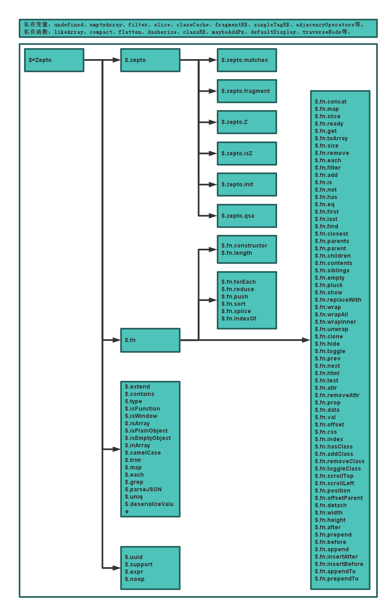
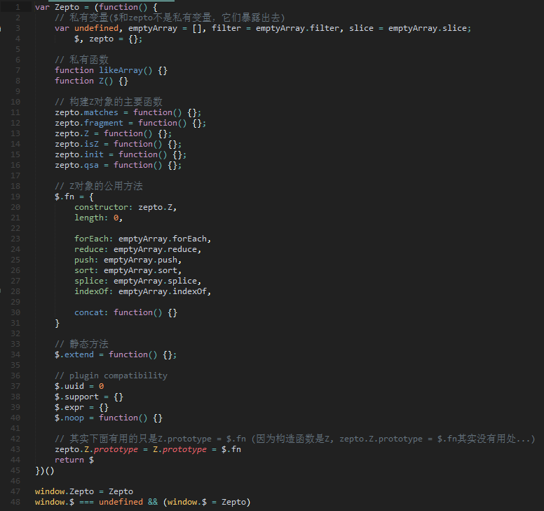
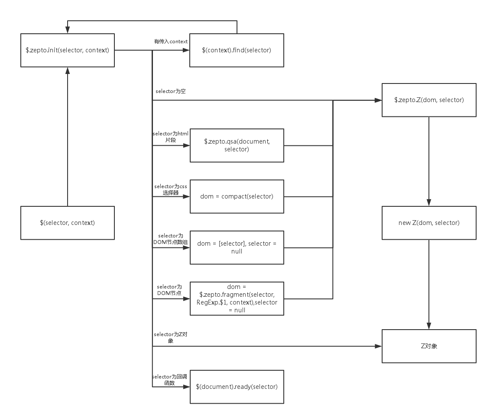

# Zepto源代码分析 - 2016-03-08

## 一、Zepto整体架构

### Zepto架构图

### Zepto架构代码

### Zepto架构说明

通过上面两张图，我们可以发现Zepto整个架构是非常的简单整洁。首先Zepto对象通过执行一个立即调用函数进行赋值，因此Zepto对象的定义就在这个立即调用函数里面，接下来把Zepto赋值给window：`window.Zepto = Zepto`。然后进行$变量名的冲突处理，如果$全局变量还没有定义，就将Zepto对象赋值给$全局变量：`window.$ === undefined && (window.$ = Zepto)`。

接下来看一下结合Zepto架构图来分析一下立即调用函数里面的代码。一开始定义了一些私有变量和私有函数，这些变量和函数为其他代码服务，不会暴露给用户($和zepto变量例外)。然后就是zepto变量的一些方法：`fragment`、`Z`、`isZ`、`init`、`qsa`，这些方法是生成Z对象(因为调用$('div')其实就是返回一个Z类的实例，所以我称它为Z对象。Z类定义在私有函数里面)的主要方法，注意这几个方法是暴露给用户的，所以用户可以重写这些方法。接下来就是Z类的原型对象：`$.fn`，所有Z对象的共享方法都保存在这里。其实到这里$.fn和Z类一点关系都没有，但是在立即调用函数的最下面有这么一行代码：`zepto.Z.prototype = Z.prototype = $.fn`，通过将Z.prototype指向$.fn对象就可以使$.fn成为真正的Z类的原型对象。再下来就是一些静态方法和插件相关的代码。最后返回$并赋值给Zepto。

### Zepto架构细节

上面说了生成Z对象的主要方法定义在zepto对象上。但是zepto对象还有一个mathces方法在生成Z对象的过程中不起作用，这个方法其实就是一个工具函数，所以应该把这个方法定义为Zepto的静态方法更加合适。

在Zepto架构图中，我把`length`、`forEach`、`reduce`、`push`、`sort`、`splice`和`indexOf`这几个属性放到了一齐，这是因为它们有特别的用途。当浏览器检测到一个对象有以上属性时，就把它们当作是类数组，从而当你在浏览器的控制台打印它们时，它们将会以数组的形式展现出来，而不是以对象的形式。实际上，在chrome浏览器中，只要有length和splice属性，对象就会被当成是类数组。

大家可能留意到，我上面说过生成Z对象的是Z类，它是一个私有函数，但是为什么$.fn.constructor指向zepto.Z？还有就是zepto.Z的原型也要修改为$.fn？这其实是因为zepto.isZ函数会通过zpeto.Z来判断是否Z对象，而非Z函数：`object instanceof zepto.Z`，所以通过使Z函数和zepto.Z的函数的原型保持一致，就可以通过zepto.Z来判断是否Z对象了。但是为什么不直接通过Z函数来判断是否Z对象呢：`object instanceof Z`？原因在于用zepto.Z方法可以被用户改写，成为新的构造函数，一旦用户改写了zepto.Z方法之后，而zepto.isZ还是通过Z类来判断Z对象，那就会导致永远都返回false了。

## 二、获取Z对象的流程

### 获取Z对象的流程图

### 获取Z对象的流程说明

$函数其实里面什么也没干，只是单纯的调用$.zepto.init函数：`return zepto.init(selector, context)`。在$.zepto.init函数内部通过不同的参数执行不同的流程，最后返回一个Z对象或者在DOMContentLoaded事件触发后执行传进来的回调函数。具体会分为以下几种情况：

+ 有传入context，回调自身：`$(context).find(selector)`
+ selector参数为空，直接调用$.zepto.Z函数：`zepto.Z()`
+ selector参数为html片段，调用$.zepto.fragment函数获取对应DOM节点再调用$.zeptoZ
+ selector参数为css选择器，调用$.zepto.qsa函数获取对应DOM节点再调用$.zepto.Z
+ selector参数为DOM节点数组，去掉数组中值为null的项，然后调用$.zepto.Z
+ selector参数为单个DOM节点，`dom = [selector]`，然后调用$.zepto.Z
+ selector参数为Z对象，直接返回该对象
+ selector参数为函数，执行`$(document).ready(selector)`，在DOM加载完的时候调用该函数

此外上面提及到的$.zepto.Z函数只是简单的new一个Z对象：`return new Z(dom, selector)`，而Z构造函数里面会把dom和selector保存起来：

	function Z(dom, selector) {
    	var i, len = dom ? dom.length : 0
    	for (i = 0; i < len; i++) this[i] = dom[i]
    	this.length = len
    	this.selector = selector || ''
  	}

### 各主要函数说明

上面其实是说明了$.zepto.init、$.zepto.Z函数，现在来讲一下$.zepto.fragment、$.zepto.isZ、$.zepto.qsa。

1、$.zepto.fragment函数
该函数的作用为

# Zepto.js – a minimalist JavaScript library

Zepto is a minimalist JavaScript library for modern browsers with a
largely jQuery-compatible API. If you use jQuery, you already know how to use Zepto.

See [zeptojs.com][] for an extended introduction, downloads
and documentation.

Zepto.js is licensed under the terms of the MIT License.

Want to give us money or a tip? Don't.
Instead please donate to [charity: water](http://charitywater.org/).

## Building

The official site offers a download of the default distribution of Zepto. This
is good for starting out. However, at some point you might want to add some
optional modules and remove some of the default ones you don't need, to keep the
size at a minimum. That's when you need to check out Zepto's source code and use
the build commands. Alternatively you can use the web based [Zepto Builder](http://github.e-sites.nl/zeptobuilder/).

You will need Node.js installed on your system.

~~~ sh
$ npm install
$ npm run-script dist

# do a custom build
$ MODULES="zepto event data" npm run-script dist

# on Windows
c:\zepto> SET MODULES=zepto event data
c:\zepto> npm run-script dist
~~~

The resulting files are:

1. `dist/zepto.js`
2. `dist/zepto.min.js`

If you install CoffeeScript globally, you can run `make` directly:

~~~ sh
# one-time operation
$ npm install coffee-script --global

$ coffee make dist
$ MODULES="zepto event data ..." ./make dist

# on Windows
c:\zepto> SET MODULES=zepto event data
c:\zepto> coffee make dist
~~~

## Zepto modules

Zepto modules are individual files in the "src/" directory.

<table>
<thead><tr>
  <th>module</th> <th>default</th> <th>description</th>
</tr></thead>
<tbody>
  <tr>
    <th><a href="src/zepto.js#files">zepto</a></th>
    <td>✔</td>
    <td>Core module; contains most methods</td>
  </tr>
  <tr>
    <th><a href="src/event.js#files">event</a></th>
    <td>✔</td>
    <td>Event handling via <code>on()</code> &amp; <code>off()</code></td>
  </tr>
  <tr>
    <th><a href="src/ajax.js#files">ajax</a></th>
    <td>✔</td>
    <td>XMLHttpRequest and JSONP functionality</td>
  </tr>
  <tr>
    <th><a href="src/form.js#files">form</a></th>
    <td>✔</td>
    <td>Serialize &amp; submit web forms</td>
  </tr>
  <tr>
    <th><a href="src/ie.js#files">ie</a></th>
    <td>✔</td>
    <td>Support for Internet Explorer 10+ on the desktop and Windows Phone 8</td>
  </tr>
  <tr>
    <th><a href="src/detect.js#files">detect</a></th>
    <td></td>
    <td>Provides <code>$.os</code> and <code>$.browser</code> information</td>
  </tr>
  <tr>
    <th><a href="src/fx.js#files">fx</a></th>
    <td></td>
    <td>The <code>animate()</code> method</td>
  </tr>
  <tr>
    <th><a href="src/fx_methods.js#files">fx_methods</a></th>
    <td></td>
    <td>
      Animated <code>show</code>, <code>hide</code>, <code>toggle</code>,
      and <code>fade*()</code> methods.
    </td>
  </tr>
  <tr>
    <th><a href="src/assets.js#files">assets</a></th>
    <td></td>
    <td>
      Experimental support for cleaning up iOS memory after removing
      image elements from the DOM.
    </td>
  </tr>
  <tr>
    <th><a href="src/data.js#files">data</a></th>
    <td></td>
    <td>
      A full-blown <code>data()</code> method, capable of storing arbitrary
      objects in memory.
    </td>
  </tr>
  <tr>
    <th><a href="src/deferred.js#files">deferred</a></th>
    <td></td>
    <td>
      Provides <code>$.Deferred</code> promises API.
      Depends on the "callbacks" module.
    </td>
  </tr>
  <tr>
    <th><a href="src/callbacks.js#files">callbacks</a></th>
    <td></td>
    <td>
      Provides <code>$.Callbacks</code> for use in "deferred" module.
    </td>
  </tr>
  <tr>
    <th><a href="src/selector.js#files">selector</a></th>
    <td></td>
    <td>
      Experimental <a href="http://api.jquery.com/category/selectors/jquery-selector-extensions/">jQuery
      CSS extensions</a> support for functionality such as <code>$('div:first')</code> and
      <code>el.is(':visible')</code>.
    </td>
  </tr>
  <tr>
    <th><a href="src/touch.js#files">touch</a></th>
    <td></td>
    <td>
      Fires tap– and swipe–related events on touch devices. This works with both
      `touch` (iOS, Android) and `pointer` events (Windows Phone).
    </td>
  </tr>
  <tr>
    <th><a href="src/gesture.js#files">gesture</a></th>
    <td></td>
    <td>Fires pinch gesture events on touch devices</td>
  </tr>
  <tr>
    <th><a href="src/stack.js#files">stack</a></th>
    <td></td>
    <td>Provides <code>andSelf</code> &amp; <code>end()</code> chaining methods</td>
  </tr>
  <tr>
    <th><a href="src/ios3.js#files">ios3</a></th>
    <td></td>
    <td>
      String.prototype.trim and Array.prototype.reduce methods
      (if they are missing) for compatibility with iOS 3.x.
    </td>
  </tr>
</tbody>
</table>

## Contributing

Please read our [contribution guidelines](https://github.com/madrobby/zepto/blob/master/CONTRIBUTING.md)
for information on how to contribute.

Get in touch:

* @[zeptojs](http://twitter.com/zeptojs)

### Write documentation

Zepto docs are written in Markdown and live in the ["gh-pages" branch][docs].
They are published on [zeptojs.com][].

You can use GitHub's web interface to make quick changes to documentation for
specific Zepto features
([example: ajaxSettings](https://github.com/madrobby/zepto/blob/gh-pages/ajax/_posts/1900-01-01-Z-ajaxSettings.md)).
This will submit a pull request to us that we can review.

### Report a bug

1. Check if the bug is already fixed in the [master branch][master] since the
   last release.
2. Check [existing issues][issues]. Open a new one, including exact browser &
   platform information. For better formatting of your report, see
   [GitHub-flavored Markdown][mkd].

### Help! It doesn't work in browserify!

We have received complaints about not supporting popular JavaScript module loaders countless times. [Here](https://github.com/madrobby/zepto/pull/342#issuecomment-3006524) is a short explanation of our decision. A good JS loader should have a way to shim libraries which don't follow the CommonJS/AMD/UMD pattern.

[Here is an example](https://github.com/silvenon/zepto-module-demo) of shimming Zepto for browserify, allowing you to easily import only needed modules while leaving the source code untouched.

### Running tests

You will need to install [PhantomJS][]. On OS X, that's easy:

~~~ sh
$ brew install phantomjs
~~~

To run the automated tests:

~~~ sh
$ npm test
~~~

To run a test server, which you can hit with your browsers and devices:

~~~ sh
$ npm start
~~~

Go to `http://your-ip-address:3000/` on your browser and follow the
instructions. For your convenience test failures and exceptions will be
reported to the the console you started the test server in (as well as
the browser console if available).

  [zeptojs.com]: http://zeptojs.com
  [master]: https://github.com/madrobby/zepto/commits/master
  [issues]: https://github.com/madrobby/zepto/issues
  [docs]: https://github.com/madrobby/zepto/tree/gh-pages#readme
  [mkd]: http://github.github.com/github-flavored-markdown/
  [evidence.js]: https://github.com/tobie/Evidence
  [phantomjs]: http://code.google.com/p/phantomjs/wiki/Installation