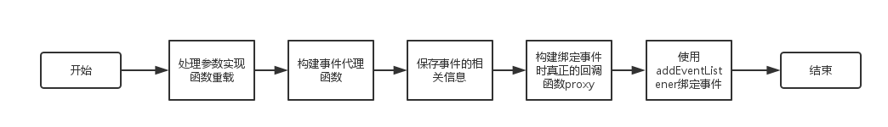

#Zepto事件模块源码分析

##一、保存事件数据的handlers

我们知道js原生api中要移除事件，需要传入绑定时的回调函数。而Zepto则可以不传入回调函数，直接移除对应类型的所有事件。原因就在于Zepto在绑定事件时，会把相关的数据都保存到`handlers`对象中，因此就可以在这个变量中查找对应事件的回调函数，来移除事件。

`handlers`对象的数据格式如下：

```javascript
{
  1: [ // handlers的值为DOM元素的_zid
    {
      del: function() {}, // 实现事件代理的函数
      e: "click", // 事件名称
      fn: function() {}, // 用户传入的回调函数
      i: 0, // 该对象在数组里的下标
      ns: "", // 事件的命名空间，只用使用$.fn.triggerHandler时可用，$.fn.trigger不能使用。
      proxy: function(e) {}, // 真正绑定事件时的回调函数，里面判断调用del或者fn
      sel: undefined // 要进行事件代理时传入的selector
    }
  ]
}
```


##二、绑定事件

###主要流程图



###流程说明

####处理参数实现函数重载

实现函数重载的重点就是判断参数的类型，处理参数：

```javascript
// 处理参数，实现函数重载
if (!isString(selector) && !isFunction(callback) && callback !== false) // 没有传入selector参数
	callback = data, data = selector, selector = undefined
if (callback === undefined || data === false) // 没有传入data参数
	callback = data, data = undefined
if (callback === false) callback = returnFalse // 回调函数传入的是false，使用returnFalse函数代替
```

####构建事件代理函数

事件代理函数的重点为：在触发元素和`e.target`之间找到和参数selector相匹配的元素，生成事件对象，触发回调函数：

```javascript
// 如果有传入selector参数，构建代理函数
if (selector) delegator = function(e){
  var evt, match = $(e.target).closest(selector, element).get(0) // match为e.target到触发元素范围内和selector相匹配的元素

  if (match && match !== element) { // 如果有相匹配的元素，改写事件对象，触发回调函数
    evt = $.extend(createProxy(e), {currentTarget: match, liveFired: element}) 
    return (autoRemove || callback).apply(match, [evt].concat(slice.call(arguments, 1)))
  }
}
```

####保存事件的相关信息

保存事件的相关信息就是根据参数组成handler对象，保存到上面提过的`handlers`对象中。需要注意的是Zepto是通过DOM对象中添加一个\_zid来连接DOM对象和对应的handler对象。

使用zid函数来赋值和获取\_zid：

```javascript
function zid(element) {
	return element._zid || (element._zid = _zid++)
}
```

通过一个\_zid而不是通过DOM对象的引用来连接handler是因为：防止移除掉DOM元素后，handlers对象还保存着对这个DOM元素的引用。通过使用\_zid就可以防止这种情况发生，避免了内存泄漏。

####构建真正的回调函数proxy

Zepto对事件对象进行了扩展，例如添加`isImmediatePropagationStopped`函数等，所以就要构建proxy函数来进行一层代理，改变触发时的事件对象。此外，如果用户需要进行事件代理，proxy函数执行时就会调用上面构建好的代理函数，否则调用用户传进来的回调函数。因此使用`addEventListener`所传入的真正回调函数就是proxy函数。

####focus和blur事件的冒泡

focus和blur事件本身是不冒泡的，如果需要对这两个事件进行事件代理，就要运用一些小技巧。首先，如果浏览器支持focusin和focusout，就使用这两个可以冒泡事件来代替。如果浏览器不支持focusion和focusout，就利用focus和blur捕获不冒泡的特性，传入`addEventListener`中的第三个参数设置true，以此来进行事件代理。


##三、取消绑定事件

取消绑定是比较简单的，由于事件绑定时都把相应的数据都保存到了`handlers`对象上，所以只要根据参数在这个对象里寻找对应的回调函数，使用`removeEventListener`取消绑定就可以了。


##四、触发事件

触发事件也比较简单，通过`document.createEvent`来创建事件对象，然后调用`dispatchEvent`来触发事件。这里有点小优化就是focus和blur事件的触发直接调用focus()和blur()。

创建事件的代码：

```javascript
$.Event = function(type, props) {
  if (!isString(type)) props = type, type = props.type
  var event = document.createEvent(specialEvents[type] || 'Events'), bubbles = true
  if (props) for (var name in props) (name == 'bubbles') ? (bubbles = !!props[name]) : (event[name] = props[name])
  event.initEvent(type, bubbles, true)
  return compatible(event)
}
```

上面有点要注意的就是当创建鼠标相关的事件时要在`document.createEvent`的第一个参数中传入’MouseEvents‘，以提供更多的事件属性。鼠标相关的事件指的是：click、mousedown、mouseup和mousemove。


##五、其他

源码大概只有300多行，中其实还有很多值得我们学习的地方，所以大家大可以花点时间阅读一下。


##六、event模块源代码

```javascript
//     Zepto.js
//     (c) 2010-2016 Thomas Fuchs
//     Zepto.js may be freely distributed under the MIT license.

;(function($){
  /*
  _zid            ：用来生成标示元素和回调函数的id，每标示一个就+1
  slice           ：Array.prototype.slice

  handlers        ：保存着所有的handler，结构如下，handlers对象的值为对应元素的_zid，值为对象数组
  {
    1: [ // handlers的值为DOM元素的_zid
      {
        del: function() {}, // 实现事件代理的函数
        e: "click", // 事件名称
        fn: function() {}, // 用户传入的回调函数
        i: 0, // 该对象在数组里的下标
        ns: "", // 事件的命名空间，只用使用$.fn.triggerHandler时可用，$.fn.trigger不能使用。
        proxy: function(e) {}, // 真正绑定事件时的回调函数，里面判断调用del或者fn
        sel: undefined // 要进行事件代理时传入的selector
      }
    ]
  }

  specialEvents   ：生成一个模拟事件时，click、mousedown、mouseup和mousemove时使用'MouseEvents'参数
  focusinSupported：是否支持focusin的Boolean值
  focus           ：浏览器支持focusin和focusout时，focus和blur就使用focusin和focusout来代替
  hover           ：mouseenter和mouseout用mouseover和mouseout实现
   */
  var _zid = 1, undefined,
      slice = Array.prototype.slice,
      isFunction = $.isFunction,
      isString = function(obj){ return typeof obj == 'string' },
      handlers = {},
      specialEvents={},
      focusinSupported = 'onfocusin' in window,
      focus = { focus: 'focusin', blur: 'focusout' },
      hover = { mouseenter: 'mouseover', mouseleave: 'mouseout' }

  specialEvents.click = specialEvents.mousedown = specialEvents.mouseup = specialEvents.mousemove = 'MouseEvents'

  // 获取元素或者函数的_zid，没有的话就生成一个。赋值给元素或者函数的_zid属性
  function zid(element) {
    return element._zid || (element._zid = _zid++)
  }

  // 根据给定的参数在handlers变量中寻找对应的handler
  function findHandlers(element, event, fn, selector) {
    event = parse(event) // 解析event参数，分离出事件名和ns
    if (event.ns) var matcher = matcherFor(event.ns) // 
    // 取出所有属于element的handler，并且根据event、fn和selector参数进行筛选
    return (handlers[zid(element)] || []).filter(function(handler) {
      return handler
        && (!event.e  || handler.e == event.e) // 事件名不同的过滤掉
        && (!event.ns || matcher.test(handler.ns)) // 命名空间不同的过滤掉
        && (!fn       || zid(handler.fn) === zid(fn)) // 回调函数不同的过滤掉(通过_zid属性判断是否同一个函数)
        && (!selector || handler.sel == selector) // selector不同的过滤掉
    })
  }

  // 解析event参数: "click.abc" -> {e: "click", ns: "abc"}
  function parse(event) {
    var parts = ('' + event).split('.')
    return {e: parts[0], ns: parts.slice(1).sort().join(' ')}
  }

  // 生成匹配的namespace表达式：'abc def' -> /(?:^| )abc .* ?def(?: |$)/
  function matcherFor(ns) {
    return new RegExp('(?:^| )' + ns.replace(' ', ' .* ?') + '(?: |$)')
  }

  // 获取绑定事件时，指定是否冒泡或捕获阶段的Boolean值
  // 需要事件代理和浏览器不支持focusin并且是focus和blur事件时返回ture，即绑定在捕获阶段
  // (因为focus和blur不会冒泡，但是会捕获)
  function eventCapture(handler, captureSetting) {
    return handler.del &&
      (!focusinSupported && (handler.e in focus)) ||
      !!captureSetting
  }

  // 返回真正绑定的事件名，例如要绑定mouseenter事件，其实真正绑定的是mouseover事件来模拟mouseenter事件。
  function realEvent(type) {
    return hover[type] || (focusinSupported && focus[type]) || type
  }

  /**
   * 添加事件的实际方法
   * @param {Object}   element   DOM元素
   * @param {String}   events    事件字符串
   * @param {Function} fn        回调函数
   * @param {All}      data      绑定事件时传入的data，可以是各种类型   
   * @param {String}   selector  被代理元素的css选择器
   * @param {[type]}   delegator 进行事件代理的函数
   * @param {[type]}   capture   指定捕获或者冒泡阶段
   */
  function add(element, events, fn, data, selector, delegator, capture){
    var id = zid(element), set = (handlers[id] || (handlers[id] = []))

    events.split(/\s/).forEach(function(event){
      // 如果事件名为ready，直接调用$.fn.ready方法
      if (event == 'ready') return $(document).ready(fn)

      // 构建handler
      var handler   = parse(event)
      handler.fn    = fn
      handler.sel   = selector

      // emulate mouseenter, mouseleave
      // mouseenter、mouseleave通过mouseover、mouseout来模拟。
      if (handler.e in hover) fn = function(e){
        // relatedTarget为相关元素，只有mouseover和mouseout事件才有
        // 对mouseover事件而言，相关元素就是那个失去光标的元素。对mouseout事件而言，相关元素则是获得光标的元素。
        var related = e.relatedTarget
        // 只当鼠标从元素外部移到元素内部才触发mouseenter，只当鼠标从元素内部移到元素外部才出发mouseleave。
        if (!related || (related !== this && !$.contains(this, related)))
          return handler.fn.apply(this, arguments)
      }


      handler.del   = delegator
      var callback  = delegator || fn // 需要进行事件代理时，调用的是封装了fn的delegator函数

      // 真正绑定事件时的回调函数
      // 通过该函数改写事件对象，为事件对象添加一些方法和属性，然后调用用户传进来的回调函数。并且使用户的回调函数返回false时禁止默认行为和禁止冒泡
      handler.proxy = function(e){
        e = compatible(e)
        if (e.isImmediatePropagationStopped()) return
        e.data = data
        var result = callback.apply(element, e._args == undefined ? [e] : [e].concat(e._args))
        if (result === false) e.preventDefault(), e.stopPropagation()
        return result
      }

      handler.i = set.length // 把handler在set中的下标赋值给handler.i
      set.push(handler) // 把handler保存起来

      // 最后绑定事件
      if ('addEventListener' in element)
        element.addEventListener(realEvent(handler.e), handler.proxy, eventCapture(handler, capture))
    })
  }

  // 删除handler
  function remove(element, events, fn, selector, capture){
    var id = zid(element)
    ;(events || '').split(/\s/).forEach(function(event){
      findHandlers(element, event, fn, selector).forEach(function(handler){
        delete handlers[id][handler.i]
      if ('removeEventListener' in element)
        element.removeEventListener(realEvent(handler.e), handler.proxy, eventCapture(handler, capture))
      })
    })
  }

  $.event = { add: add, remove: remove }

  $.proxy = function(fn, context) {
    var args = (2 in arguments) && slice.call(arguments, 2) // 第三个以及之后的参数

    // 参数fn为函数
    if (isFunction(fn)) {
      var proxyFn = function(){ return fn.apply(context, args ? args.concat(slice.call(arguments)) : arguments) }
      proxyFn._zid = zid(fn)
      return proxyFn
    // 第一个参数为对象的情况：$.proxy(context, "fnName" )
    } else if (isString(context)) {
      if (args) {
        args.unshift(fn[context], fn)
        return $.proxy.apply(null, args)
      } else {
        return $.proxy(fn[context], fn)
      }
    } else {
      throw new TypeError("expected function")
    }
  }

  $.fn.bind = function(event, data, callback){
    return this.on(event, data, callback)
  }
  $.fn.unbind = function(event, callback){
    return this.off(event, callback)
  }
  $.fn.one = function(event, selector, data, callback){
    return this.on(event, selector, data, callback, 1)
  }

  var returnTrue = function(){return true}, // 在compatible里有用到
      returnFalse = function(){return false}, // 在compatible里有用到
      // 构建事件对象时所不要的几个属性：returnValue、layerX和layerY(还有以大写字母开头的属性？)
      ignoreProperties = /^([A-Z]|returnValue$|layer[XY]$)/, 
      // 事件对象需要添加的三个方法名
      eventMethods = {
        preventDefault: 'isDefaultPrevented',
        stopImmediatePropagation: 'isImmediatePropagationStopped',
        stopPropagation: 'isPropagationStopped'
      }

  // 添加eventMethods里面的三个方法：isDefaultPrevented、isDefaultPrevented和isPropagationStopped
  function compatible(event, source) {
    if (source || !event.isDefaultPrevented) {
      source || (source = event)

      // 通过改写原生的preventDefault、stopImmediatePropagation和stopPropagation方法实现
      $.each(eventMethods, function(name, predicate) {
        var sourceMethod = source[name]
        event[name] = function(){
          this[predicate] = returnTrue
          return sourceMethod && sourceMethod.apply(source, arguments)
        }
        event[predicate] = returnFalse
      })

      // 设置isDefaultPrevented默认指向的函数
      if (source.defaultPrevented !== undefined ? source.defaultPrevented : // 如果有defaultPrevented属性，就根据defaultPrevented的值来判断
          'returnValue' in source ? source.returnValue === false : // returnValue属性只在beforeunload事件中有用。而且用途是设置弹出框的文案，所以这行代码应该有问题，可以去掉
          source.getPreventDefault && source.getPreventDefault()) // getPreventDefault和defaultPrevented属性类似，不过是非标准的。为了兼容没有defaultPrevented参数的浏览器。
        event.isDefaultPrevented = returnTrue
    }
    return event
  }

  // 构建事件代理中的事件对象
  function createProxy(event) {
    var key, proxy = { originalEvent: event } // 新的事件对象有个originalEvent属性指向原对象

    // 将原生事件对象的属性复制给新对象，除了returnValue、layerX、layerY和值为undefined的属性
    // returnValue属性为beforeunload事件独有
    for (key in event)
      if (!ignoreProperties.test(key) && event[key] !== undefined) proxy[key] = event[key]

    // 添加eventMethods里面的几个方法，并返回新的事件对象
    return compatible(proxy, event) 
  }

  $.fn.delegate = function(selector, event, callback){
    return this.on(event, selector, callback)
  }
  $.fn.undelegate = function(selector, event, callback){
    return this.off(event, selector, callback)
  }

  $.fn.live = function(event, callback){
    // 通过document.body元素代理事件
    $(document.body).delegate(this.selector, event, callback)
    return this
  }
  $.fn.die = function(event, callback){
    // 移除掉document.body元素的相关代理事件
    $(document.body).undelegate(this.selector, event, callback)
    return this
  }

  // 只负责处理参数，绑定事件交由add函数处理
  $.fn.on = function(event, selector, data, callback, one){
    var autoRemove, delegator, $this = this
    // event参数为对象，回调自身进行批量绑定事件
    if (event && !isString(event)) {
      $.each(event, function(type, fn){
        $this.on(type, selector, data, fn, one)
      })
      return $this
    }

    // 处理参数，实现函数重载
    if (!isString(selector) && !isFunction(callback) && callback !== false) // 没有传入selector参数
      callback = data, data = selector, selector = undefined
    if (callback === undefined || data === false) // 没有传入data参数
      callback = data, data = undefined
    if (callback === false) callback = returnFalse // 回调函数传入的是false，使用returnFalse函数代替

    // 给每一个Z对象里面的元素绑定事件
    return $this.each(function(_, element){
      // 如果有传入one参数，使用下面的autoRemove函数代替callback。执行一次后会自动移除该事件的绑定
      if (one) autoRemove = function(e){
        remove(element, e.type, callback)
        return callback.apply(this, arguments)
      }

      // 如果有传入selector参数，构建代理函数
      if (selector) delegator = function(e){
        var evt, match = $(e.target).closest(selector, element).get(0) // match为e.target到触发元素范围内和selector相匹配的元素

        if (match && match !== element) { // 如果有相匹配的元素，改写事件对象，触发回调函数
          evt = $.extend(createProxy(e), {currentTarget: match, liveFired: element}) 
          return (autoRemove || callback).apply(match, [evt].concat(slice.call(arguments, 1)))
        }
      }

      // 通过add函数来绑定事件
      add(element, event, callback, data, selector, delegator || autoRemove)
    })
  }

  $.fn.off = function(event, selector, callback){
    var $this = this
    // event参数为对象，回调自身进行批量取消绑定事件
    if (event && !isString(event)) {
      $.each(event, function(type, fn){
        $this.off(type, selector, fn)
      })
      return $this
    }

    // 处理参数，实现函数重载
    if (!isString(selector) && !isFunction(callback) && callback !== false) // 没有传入selector参数
      callback = selector, selector = undefined
    if (callback === false) callback = returnFalse // 回调函数传入的是false，使用returnFalse函数代替


    return $this.each(function(){
      remove(this, event, callback, selector)
    })
  }

  $.fn.trigger = function(event, args){
    event = (isString(event) || $.isPlainObject(event)) ? $.Event(event) : compatible(event)
    event._args = args
    return this.each(function(){
      // handle focus(), blur() by calling them directly
      // 通过直接调用focus()和blur()方法来触发对应事件，这算是对触发事件方法的一个优化
      if (event.type in focus && typeof this[event.type] == "function") this[event.type]()
      // items in the collection might not be DOM elements
      else if ('dispatchEvent' in this) this.dispatchEvent(event)
      else $(this).triggerHandler(event, args)
    })
  }

  // triggers event handlers on current element just as if an event occurred,
  // doesn't trigger an actual event, doesn't bubble
  // 直接触发事件的回调函数，而不是直接触发一个事件，所以也不冒泡
  $.fn.triggerHandler = function(event, args){
    var e, result
    this.each(function(i, element){
      e = createProxy(isString(event) ? $.Event(event) : event)
      e._args = args
      e.target = element
      $.each(findHandlers(element, event.type || event), function(i, handler){
        result = handler.proxy(e)
        if (e.isImmediatePropagationStopped()) return false
      })
    })
    return result
  }

  // shortcut methods for `.bind(event, fn)` for each event type
  // 绑定和触发事件的快捷方式
  ;('focusin focusout focus blur load resize scroll unload click dblclick '+
  'mousedown mouseup mousemove mouseover mouseout mouseenter mouseleave '+
  'change select keydown keypress keyup error').split(' ').forEach(function(event) {
    $.fn[event] = function(callback) {
      return (0 in arguments) ?
        this.bind(event, callback) :
        this.trigger(event)
    }
  })

  // 生成一个模拟事件，如果是鼠标相关事件，document.createEvent传入的第一个参数为'MouseEvents'，以提供更多的参数
  $.Event = function(type, props) {
    if (!isString(type)) props = type, type = props.type
    var event = document.createEvent(specialEvents[type] || 'Events'), bubbles = true
    if (props) for (var name in props) (name == 'bubbles') ? (bubbles = !!props[name]) : (event[name] = props[name])
    event.initEvent(type, bubbles, true)
    return compatible(event)
  }

})(Zepto)

```