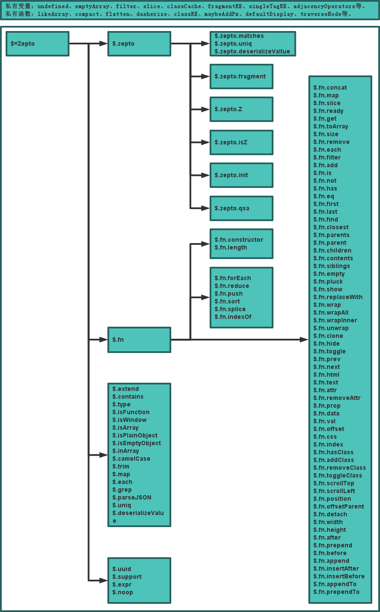
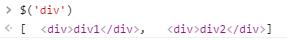
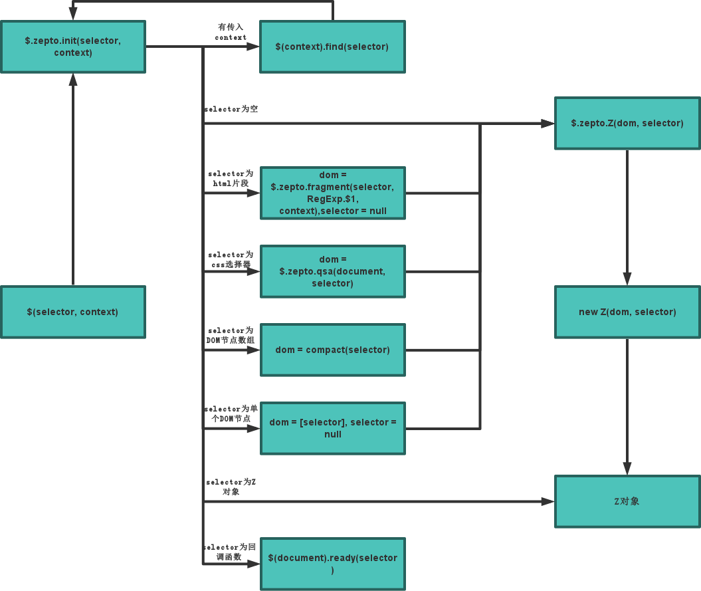
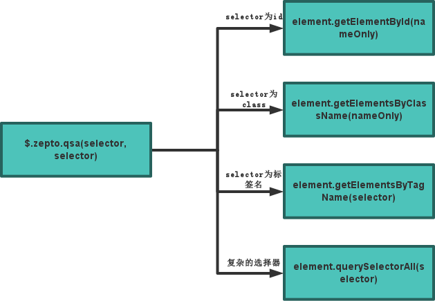

#Zepto核心模块源码分析

## 一、Zepto核心模块架构

### Zepto核心模块架构图

该图展示了Zepto核心模块架构代码的组织方式。主要分为私有变量、函数和暴露给用户的所有api。



### Zepto核心模块架构代码

该图展示了Zepto的核心模块架构代码，忽略了所有实现的细节。

```javascript
var Zepto = (function() {
	// 私有变量($和zepto不是私有变量，它们会被暴露出去)
	var undefined, emptyArray = [], filter = emptyArray.filter, slice = emptyArray.slice,
		$, zepto = {};

	// 私有函数
	function likeArray() {}
	// Z类
	function Z() {}

	// 构建Z对象的主要函数
	zepto.matches = function() {};
	zepto.fragment = function() {};
	zepto.Z = function() {
		return new Z(dom, selector)
	};
	zepto.isZ = function() {
		return object instanceof zepto.Z
	};
	zepto.init = function() {};
	zepto.qsa = function() {};

	// Z对象的共享方法
	$.fn = {
		constructor: zepto.Z,
	    length: 0,

	    forEach: emptyArray.forEach,
	    reduce: emptyArray.reduce,
	    push: emptyArray.push,
	    sort: emptyArray.sort,
	    splice: emptyArray.splice,
	    indexOf: emptyArray.indexOf,

	    concat: function() {}
	}

	// 静态方法
	$.extend = function() {};

	// plugin compatibility
	$.uuid = 0
	$.support = {}
	$.expr = {}
	$.noop = function() {}

	// 修改zepto.Z和Z的原型都指向$.fn
	zepto.Z.prototype = Z.prototype = $.fn

	// 把内部的一些API函数通过$.zepto命名空间暴露出去
	zepto.uniq = uniq
	zepto.deserializeValue = deserializeValue
	$.zepto = zepto

	return $
})()

window.Zepto = Zepto
window.$ === undefined && (window.$ = Zepto)
```


### Zepto核心模块架构说明

通过上面两张图，我们可以发现Zepto核心模块整个架构是非常的简单整洁。首先Zepto对象通过执行一个立即调用函数进行赋值，因此Zepto对象的定义就在这个立即调用函数里面，接下来把Zepto赋值给window：`window.Zepto = Zepto`。然后进行$变量名的冲突处理，如果$全局变量还没有定义，就将Zepto对象赋值给$全局变量：`window.$ === undefined && (window.$ = Zepto)`。

接下来分析一下立即调用函数里面的代码。一开始定义了一些私有变量和私有函数，这些变量和函数为其他代码服务，不会暴露给用户（$和zepto变量例外，zepto会通过$属性的形式暴露出去，即等于$.zepto），其中最重要的一个函数为**Z类**，调用$函数生成的对象都是Z类的实例，我称其为**Z对象**。然后就是$.zepto对象的一些方法，主要分为两类，第一类：`fragment`、`Z`、`isZ`、`init`、`qsa`，这些方法是生成Z对象的主要方法，用户可以通过重写这些方法，来实现兼容低版本的浏览器。$.zepto对象的第二类方法：`matches`、`uniq`、`deserializeValue`，这些方法其实就是一些静态方法。接下来就是Z类的原型对象：`$.fn`，所有Z对象的共享方法都保存在这里。其实到这里$.fn和Z类一点关系都没有，但是在立即调用函数的最下面有这么一行代码：`zepto.Z.prototype = Z.prototype = $.fn`，通过将Z.prototype指向$.fn对象就可以使$.fn成为真正Z类的原型对象。再下来就是一些静态方法`$.extend`和插件相关的代码。最后返回$并赋值给Zepto。

### Zepto核心模块架构细节

在Zepto架构图中，我把`length`、`forEach`、`reduce`、`push`、`sort`、`splice`和`indexOf`这几个属性放到了一齐，这是因为它们有特别的用途。当浏览器检测到一个对象有以上属性时，就把它们当作是类数组，从而当你在浏览器的控制台打印它们时，它们将会以数组的形式展现出来，而不是以对象的形式。实际上，在chrome浏览器中，只要有length和splice属性，对象就会被当成是类数组：

大家也可能留意到，我上面说过生成Z对象的是Z类，它是一个私有函数，但是为什么$.fn.constructor要指向$.zepto.Z？还有就是$.zepto.Z的原型也要修改为$.fn？这其实是因为$.zepto.isZ方法会通过$.zpeto.Z来判断是否Z对象，而非Z函数：`object instanceof zepto.Z`，所以通过使Z函数和zepto.Z的函数的原型保持一致，就可以通过zepto.Z来判断是否Z对象了。但是为什么不直接通过Z函数来判断是否Z对象呢：`object instanceof Z`？原因在于用zepto.Z方法可以被用户改写，成为新的构造函数。所以如果一旦用户改写了$.zepto.Z方法之后，而zepto.isZ还是通过Z类来判断Z对象，那就会导致永远都返回false了。


## 二、获取Z对象

### 获取Z对象的流程图



### 获取Z对象的流程说明

其实$函数里面什么也没干，只是单纯的调用$.zepto.init方法：`return zepto.init(selector, context)`。所以$.zepto.init方法里面的逻辑就是获取Z对象的逻辑。在$.zepto.init方法内部通过不同的参数执行不同的流程，最后返回一个Z对象或者在DOMContentLoaded事件触发后执行传进来的回调函数。具体会分为以下几种情况：

+ 有传入context，回调自身：`$(context).find(selector)`
+ selector参数为空，直接调用$.zepto.Z方法获取Z对象：`zepto.Z()`
+ selector参数为html片段，调用$.zepto.fragment方法获取对应DOM节点再调用$.zeptoZ方法获取Z对象
+ selector参数为css选择器，调用$.zepto.qsa方法获取对应DOM节点再调用$.zepto.Z方法获取Z对象
+ selector参数为DOM节点数组，去掉数组中值为null的项，调用$.zepto.Z方法获取Z对象
+ selector参数为单个DOM节点，`dom = [selector]`，然后调用$.zepto.Z方法获取Z对象
+ selector参数为Z对象，直接返回该Z对象
+ selector参数为函数，执行`$(document).ready(selector)`，在DOM加载完的时候调用该函数

此外上面提及到的调用$.zepto.Z方法只是简单的new一个Z对象：`return new Z(dom, selector)`，Z类里面会把dom和selector保存起来，供其他方法使用。Z类的代码也很简单：

```javascript
function Z(dom, selector) {
	var i, len = dom ? dom.length : 0
	for (i = 0; i < len; i++) this[i] = dom[i]
	this.length = len
	this.selector = selector || ''
}
```

### $.zepto.qsa方法说明



$.zepto.qsa方法是Zepto的css选择器实现，非常重要，但是从上图可以看出代码实现不复杂，主要就是利用原生的element.querySelectorAll方法实现。只不过对selector参数添加了一些判断，对简单的id、class和标签名使用效率更好的原生方法实现。

###$.zepto.fragment方法说明

$.zepto.fragment方法的主要功能是根据给出的html片段生成对应的DOM节点。实现的大概思路是生成一个临时的父元素，然后把html片段参数赋值给父元素的innerHTML，这样就可以生成html片段对应的节点。其中需要注意的是临时的父元素在大部分情况之下应该是一个div节点，但是当html片段是表格相关的元素时，父元素就不能是div节点。例如html片段参数本该生成的是tr节点，所以它的临时父元素就应该是tbody节点。这是因为如果表格元素没有添加到正确的父元素里面，会导致不能生成正确的节点。


##三、常用共享函数解释

###$.fn.ready

Zepto的常用功能之一就是在$函数里面传入一个回调函数，把代码都写在该回调函数里面，保证代码在DOM加载完之后才执行，例如：`$(function(){})`。其实该方法是调用$.fn.ready完成的，前面的代码等价于：`$(document).ready(function(){})`。

该方法先根据document.readyState的值判断DOM是否加载完成，完成就直接触发传进来的回调函数。否则在DOMContentLoaded事件触发的时候调用该回调函数。

###$.fn.show

$.fn.show方法也是我们用得非常多的一个方法，实现逻辑为：1、内联样式element.style.display值为'none'的话就设置为空字符串''。2、如果是在非内联样式设置了display:none，那就先获取对应元素的默认display值，赋值给element.style.display。而获取元素的默认值就通过新建一个同名标签节点，然后获取它的display值就等于该元素的默认display值了。此外，获取默认值涉及到DOM的操作，速度比较慢，所以每次获取到的值都会保存到私有变量elementDisplay中缓存起来，以后要获取同类标签默认值的时候就可以在缓存里面获取。

###$.fn.addClass

$.fn.addClass的实现思路大概是：1、判断元素是否有对应类名。2、如果没有的话就直接添加到元素的className中。

需要展开的就是如何判断是否有对应类型，Zepto的做法就是通过类名创建可以正则表达式来进行判断，创建正则表达式的函数如下：

```javascript
funcion classRE(name) {
	return name in classCache ?
		classCache[name] : (classCache[name] = new RegExp('(^|\\s)' + name + '(\\s|$)'))
}
```


##四、链式调用

使用Zepto过程中最为常用的特性应该就是链式调用了，例如：`$('.outer-div').find('.inner-div').addClass('div')`。这种功能其实很容易实现，具体方法就是在$.fn中的共享方法里面返回自身this就可以了。下面为一个简单的例子：
```javascript
$.fn.sayHi = function() {
	alert('hi');
    return this;
}
```


##五、功能扩展

Zepto按功能划分把代码分散到不同的js文件里，默认下载的话包含zepto、event、ajax、form 和 ie这几个模块，其中zepto就是本文所介绍的核心模块。此外Zepto还提供fx、deferred、touch等可选模块，大家可以根据自己的需求构建自己所需要的Zepto，具体方法可以看官网的[Github](https://github.com/madrobby/zepto)。

而合并各模块的方法也很简单，只要给$对象和$.fn对象添加方法就完成了静态方法和共享方法的扩展，例子如下：

```javascript
;(function($){
	$.Sayhi = function(){}; // 扩展静态方法
    $.fn.sayhi = function(){}; // 扩展共享方法
})(Zepto)
```


##六、结束语

Zepto核心模块的分析到此结束，具体的实现细节大家可以到我的[Github](https://github.com/oadaM92/zepto)查看我做的详细注释。Zepto核心代码量只有1000行左右，还是很值得大家花点时间去研究一下的。接下来我也会分析每一个模块，并且分享出来。如果这篇博客对大家有帮助，大家可以在右下角点一下推荐或者到我Github上点个Star。或者如果大家发现了这篇文章的错漏之处，可以在下面做出留言，我会尽快回复 :-D